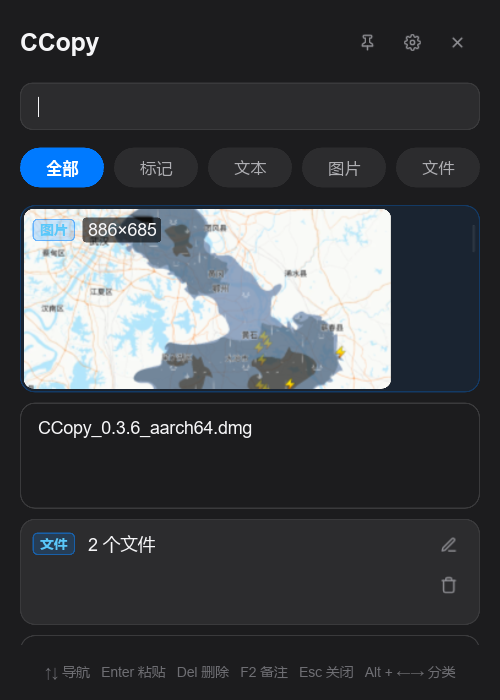

# CCopy

剪贴板历史记录工具，使用 Rust + Slint 开发。

## 功能特性

- 📝 **文本历史** - 自动记录所有复制的文本内容
- 🖼️ **图片预览** - 支持图片复制，自动生成缩略图预览
- 📁 **文件记录** - 记录复制的文件路径，显示文件名列表
- 🔍 **搜索过滤** - 支持关键词搜索历史记录
- 🏷️ **分类筛选** - 按「全部/文本/图片/文件」快速筛选
- ⌨️ **键盘导航** - 全快捷键操作，无需鼠标
- 🔥 **热重载** - 开发模式下修改 UI 无需重启程序
- 📦 **持久化存储** - 使用 SQLite 保存历史记录，重启不丢失
- 🎯 **光标定位** - Windows 下自动在光标附近弹出窗口
- ⚙️ **设置页** - 可视化配置开机自启、全局热键等
- 🚀 **开机自启** - 支持系统开机自动启动
- 🔄 **更新检查** - 自动检查 GitHub 最新版本
- 🗑️ **托盘菜单** - 系统托盘快捷操作

## 截图展示



## 快捷键

| 快捷键 | 操作 |
|---|---|
| `Alt + V` | 唤起面板（全局快捷键，可在设置中修改） |
| `↑` / `↓` | 在列表中上下切换选中项 |
| `Alt + ←` / `Alt + →` | 切换分类筛选 |
| `Enter` | 选中当前项并粘贴到原窗口 |
| `Esc` | 关闭面板 |

## 使用说明

1. 复制任意内容（文本、图片、文件）都会自动记录
2. 按下 `Alt + V` 唤起历史面板
3. 使用方向键上下选择，或直接点击项目
4. 按下回车自动粘贴到之前的编辑器
5. 点击项目右侧 × 删除记录
6. 在设置页可配置开机自启和全局热键

## 依赖

- Rust 1.88+
- Slint 1.16.1

## 编译

```bash
cargo build --release
```

## 打包

使用 cargo-packager 生成安装包：

```bash
# Windows NSIS 安装包
cargo packager --release --formats nsis

# macOS DMG
cargo packager --release --formats dmg
```

## 开发

调试模式自动启用 Slint 热重载，修改 `src/ui/main.slint` 后保存即可看到变化：

```bash
cargo run
```

## 项目结构

```
CCopy/
├── src/
│   ├── ui/
│   │   ├── main.slint        # 主界面 UI 定义
│   │   └── settings.slint    # 设置页 UI 定义
│   ├── main.rs               # 主入口
│   ├── clipboard_history.rs  # 剪贴板监听
│   ├── clipboard_item.rs     # 数据结构
│   ├── storage.rs            # SQLite 存储
│   ├── categories.rs         # 分类逻辑
│   ├── filter.rs             # 搜索过滤
│   ├── platform.rs           # 平台相关（窗口定位、粘贴）
│   ├── hotkey.rs             # 全局热键
│   ├── autostart.rs          # 开机自启
│   ├── settings.rs           # 设置管理
│   ├── updater.rs            # 更新检查
│   ├── tray.rs               # 系统托盘
│   ├── drag.rs               # 窗口拖动
│   └── common.rs             # 公共工具
├── build.rs                  # Slint UI 编译脚本
├── packager/                 # 打包资源（图标、NSI 脚本）
└── Cargo.toml
```
